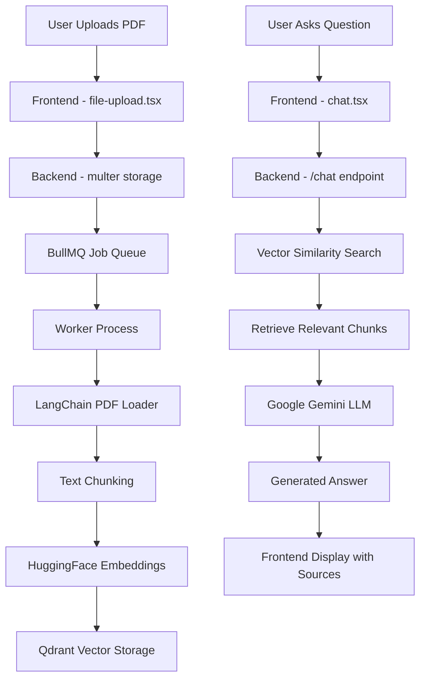

# 🏗️ RAG Document-Based Chatbot - Project Structure & Architecture

## 📁 **Project Directory Structure**

```
Document Based Chatbot/
├── 📁 client/                          # Frontend Application
│   ├── 📁 app/                         # Next.js App Router
│   │   ├── 📁 components/              # React Components
│   │   │   ├── 📄 chat.tsx            # Main chat interface
│   │   │   └── 📄 file-upload.tsx     # PDF upload component
│   │   ├── 📄 globals.css             # Global styles
│   │   ├── 📄 layout.tsx              # App layout wrapper
│   │   └── 📄 page.tsx                # Home page
│   ├── 📁 public/                      # Static assets
│   ├── 📄 package.json                # Frontend dependencies
│   ├── 📄 next.config.ts              # Next.js configuration
│   ├── 📄 tailwind.config.js          # Tailwind CSS config
│   └── 📄 tsconfig.json               # TypeScript config
├── 📁 server/                          # Backend Application
│   ├── 📁 uploads/                     # PDF file storage
│   ├── 📄 index.js                    # Main server file
│   ├── 📄 worker.js                   # Background job processor
│   ├── 📄 package.json                # Backend dependencies
│   └── 📄 .env                        # Environment variables
├── 📄 README.md                       # Project documentation
├── 📄 PROJECT_STRUCTURE.md            # This file
├── 📄 .gitignore                      # Git ignore rules
└── 📄 docker-compose.yml              # Container orchestration
```

---

## 🛠️ **Complete Tech Stack Breakdown**

### **Frontend Stack (Client)**

| Technology       | Version | Purpose                   | File Location               |
| ---------------- | ------- | ------------------------- | --------------------------- |
| **Next.js**      | 15.4.3  | React framework with SSR  | `client/package.json`       |
| **TypeScript**   | 5.0+    | Type-safe JavaScript      | `client/tsconfig.json`      |
| **React**        | 19.1.0  | UI library                | `client/app/components/`    |
| **Tailwind CSS** | 3.4+    | Utility-first CSS         | `client/tailwind.config.js` |
| **shadcn/ui**    | Latest  | Modern UI components      | `client/app/components/`    |
| **Clerk**        | 6.25.5  | Authentication (optional) | `client/package.json`       |

### **Backend Stack (Server)**

| Technology     | Version | Purpose               | File Location     |
| -------------- | ------- | --------------------- | ----------------- |
| **Node.js**    | 18+     | JavaScript runtime    | System            |
| **Express.js** | 5.1.0   | Web framework         | `server/index.js` |
| **Multer**     | 2.0.2   | File upload handling  | `server/index.js` |
| **BullMQ**     | 5.36+   | Job queue system      | `server/index.js` |
| **dotenv**     | 16.4+   | Environment variables | `server/index.js` |

### **AI & ML Stack**

| Technology                   | Purpose                            | Implementation     |
| ---------------------------- | ---------------------------------- | ------------------ |
| **LangChain**                | AI framework & document processing | `server/worker.js` |
| **Google Gemini 2.0**        | Large Language Model               | `server/index.js`  |
| **HuggingFace Transformers** | Text embeddings                    | `server/worker.js` |
| **Xenova/all-MiniLM-L6-v2**  | Embedding model (384 dimensions)   | `server/worker.js` |

### **Database & Infrastructure**

| Technology            | Port | Purpose           | Configuration           |
| --------------------- | ---- | ----------------- | ----------------------- |
| **Qdrant**            | 6333 | Vector database   | `http://localhost:6333` |
| **Redis**             | 6379 | Job queue storage | `localhost:6379`        |
| **Local File System** | -    | PDF storage       | `server/uploads/`       |

---

## 🔄 **Application Architecture Flow**



---

## 📋 **Feature Implementation Details**

### **1. 📄 PDF Upload System**

**Files Involved:**

- `client/app/components/file-upload.tsx` - Frontend upload UI
- `server/index.js` - Backend upload handling

**Tech Stack:**

```javascript
// Frontend
import React, { useState } from "react";

// Backend
import multer from "multer";
import { Queue } from "bullmq";
```

**Implementation:**

1. **Frontend**: React file input with drag-and-drop
2. **Backend**: Multer disk storage with unique filenames
3. **Job Queue**: BullMQ adds processing job to Redis

**Code Flow:**

```javascript
// Multer configuration
const storage = multer.diskStorage({
  destination: "./uploads",
  filename: (req, file, cb) => {
    const uniqueSuffix = Date.now() + "-" + Math.round(Math.random() * 1e9);
    cb(null, `${uniqueSuffix}-${file.originalname}`);
  },
});
```

### **2. 🤖 Document Processing Pipeline**

**Files Involved:**

- `server/worker.js` - Background processing
- `server/uploads/` - File storage

**Tech Stack:**

```javascript
import { PDFLoader } from "@langchain/community/document_loaders/fs/pdf";
import { CharacterTextSplitter } from "@langchain/textsplitters";
import { HuggingFaceTransformersEmbeddings } from "@langchain/community/embeddings/huggingface_transformers";
```

**Process:**

1. **PDF Loading**: LangChain PDFLoader extracts text
2. **Text Chunking**: Split into 300-character chunks
3. **Embedding Generation**: Convert to 384-dimensional vectors
4. **Vector Storage**: Store in Qdrant with metadata

### **3. 🧠 Vector Database Integration**

**Files Involved:**

- `server/worker.js` - Vector storage
- `server/index.js` - Vector retrieval

**Tech Stack:**

```javascript
import { QdrantClient } from "@qdrant/js-client-rest";
import { QdrantVectorStore } from "@langchain/qdrant";
```

**Configuration:**

- **Collection Name**: "Books"
- **Vector Dimensions**: 384
- **Distance Metric**: Cosine similarity
- **Database URL**: `http://localhost:6333`

### **4. 💬 Chat Interface System**

**Files Involved:**

- `client/app/components/chat.tsx` - React chat UI
- `server/index.js` - Chat API endpoint

**Tech Stack:**

```typescript
// Frontend
interface IMessage {
  role: "assistant" | "user";
  content?: string;
  documents?: Doc[];
}

// Backend
import { GoogleGenerativeAI } from "@google/generative-ai";
```

**Features:**

- Real-time messaging
- Source document display
- Loading indicators
- Error handling

### **5. 🔍 Semantic Search & Retrieval**

**Implementation:**

```javascript
const retriever = vectorStore.asRetriever({ k: 3 });
const result = await retriever.invoke(userQuery);
```

**Process:**

1. User query converted to vector
2. Qdrant finds 3 most similar chunks
3. Returns content with metadata (page numbers, source)

### **6. 🚀 AI Response Generation**

**Tech Stack:**

```javascript
const genAI = new GoogleGenerativeAI(process.env.GOOGLE_API_KEY);
const model = genAI.getGenerativeModel({ model: "gemini-2.0-flash" });
```

**RAG Implementation:**

```javascript
const contextString = retrievedDocs
  .map((doc, i) => `Context ${i + 1}:\n${doc.pageContent}`)
  .join("\n\n");

const prompt = `Use the following context to answer: ${contextString}\nQuestion: ${userQuery}`;
```

---

## 🔧 **Configuration Files**

### **Environment Variables (`server/.env`)**

```env
# AI Service
GOOGLE_API_KEY=your_gemini_api_key_here

# Vector Database
QDRANT_URL=http://localhost:6333

# Job Queue
REDIS_HOST=localhost
REDIS_PORT=6379
```

### **Package Dependencies**

**Backend Dependencies:**

```json
{
  "express": "^5.1.0",
  "multer": "^2.0.2",
  "bullmq": "^5.36.3",
  "@google/generative-ai": "^0.24.0",
  "@langchain/qdrant": "^0.3.3",
  "@langchain/community": "^0.3.23",
  "dotenv": "^16.4.7"
}
```

**Frontend Dependencies:**

```json
{
  "next": "15.4.3",
  "react": "19.1.0",
  "typescript": "^5",
  "tailwindcss": "^3.4.1",
  "@clerk/nextjs": "^6.25.5"
}
```

---

## 🚦 **API Endpoints**

### **Backend Routes (`server/index.js`)**

| Method | Endpoint      | Purpose      | Request           | Response                        |
| ------ | ------------- | ------------ | ----------------- | ------------------------------- |
| `GET`  | `/`           | Health check | None              | `{ status: "All Good" }`        |
| `POST` | `/upload/pdf` | Upload PDF   | FormData with PDF | `{ message: "Uploaded" }`       |
| `GET`  | `/chat`       | Ask question | `?message=query`  | `{ question, answer, results }` |

### **Frontend Components**

| Component       | File              | Purpose        | Props      |
| --------------- | ----------------- | -------------- | ---------- |
| `FileUpload`    | `file-upload.tsx` | PDF upload UI  | None       |
| `ChatComponent` | `chat.tsx`        | Chat interface | None       |
| `Layout`        | `layout.tsx`      | App wrapper    | `children` |

---

## 🔄 **Data Flow Diagram**

```
┌─────────────────┐    ┌─────────────────┐    ┌─────────────────┐
│   User Action   │    │   Processing    │    │    Storage      │
├─────────────────┤    ├─────────────────┤    ├─────────────────┤
│ 1. Upload PDF   │ -> │ 4. Extract Text │ -> │ 7. Vector DB    │
│ 2. Ask Question │    │ 5. Create Chunks│    │ 8. File System  │
│ 3. View Answer  │ <- │ 6. Generate AI  │ <- │ 9. Redis Queue  │
└─────────────────┘    └─────────────────┘    └─────────────────┘
```

---

## 🐳 **Deployment Architecture**

### **Docker Services**

```yaml
services:
  redis:
    image: redis:alpine
    ports: ["6379:6379"]

  qdrant:
    image: qdrant/qdrant
    ports: ["6333:6333"]

  app:
    build: .
    ports: ["3000:3000", "8000:8000"]
    depends_on: [redis, qdrant]
```

### **Production Considerations**

- **Scaling**: Horizontal scaling with load balancers
- **Storage**: Cloud storage for PDF files
- **Database**: Managed Qdrant or alternative vector DB
- **Monitoring**: Application performance monitoring
- **Security**: API rate limiting, authentication

---

## 🔍 **Development Workflow**

### **Local Development Setup**

1. **Start Services**: Redis + Qdrant
2. **Backend**: `cd server && npm run dev`
3. **Frontend**: `cd client && npm run dev`
4. **Worker**: Background job processing

### **File Processing Flow**

```
PDF Upload -> Multer Storage -> BullMQ Job -> Worker Process ->
PDF Extract -> Text Chunks -> Embeddings -> Qdrant Storage
```

### **Query Processing Flow**

```
User Question -> Vector Search -> Relevant Chunks ->
LLM Context -> AI Response -> Frontend Display
```

---

## 🎯 **Key Features Summary**

| Feature             | Implementation       | Files Involved                |
| ------------------- | -------------------- | ----------------------------- |
| **PDF Upload**      | Multer + BullMQ      | `index.js`, `file-upload.tsx` |
| **Text Processing** | LangChain + Chunking | `worker.js`                   |
| **Embeddings**      | HuggingFace Local    | `worker.js`                   |
| **Vector Search**   | Qdrant Database      | `index.js`, `worker.js`       |
| **AI Chat**         | Google Gemini        | `index.js`, `chat.tsx`        |
| **UI/UX**           | Next.js + Tailwind   | `client/app/`                 |

This architecture creates a robust, scalable RAG system that can intelligently process documents and answer questions with proper source attribution! 🚀
